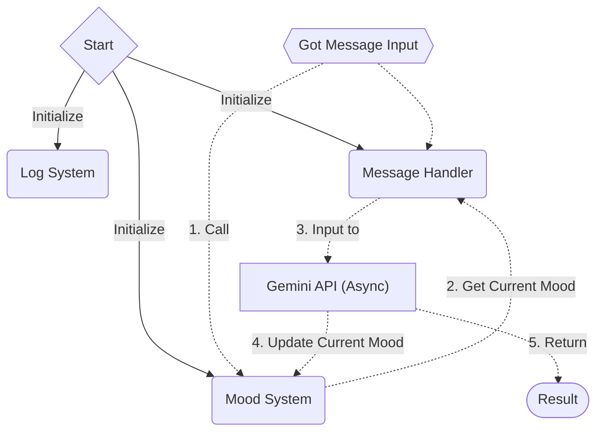

## 專案 WorkFlow (僅供參考)



## 初次設定專案
### 安裝所需的函式庫/模組
```shell
# Windows 系統執行下面命令
pip install -r requirements.txt

# Linux 發行版系統執行下面命令
pip install -r requirements-linux.txt
```
### 設定 secret key
1. 在專案根目錄新建 `settings/secret.json`
2. 取得一個 Gemini 的 API KEY
3. 將 API KEY 的字串放到 `settings/secret.json` 中
  ```json
  {
      "gemini-api-key": "AIxxxxxxxxxxx..."
  }
  ```

## 後端處理程式
> 後端負責的是資料儲存、整合資訊與生程式 AI 互動。
### 主要使用的 API
#### 生成式 AI 互動套件
* 套件名稱: `genai`
* 套件位置: `scripts/genai/`
* 套件功能: 
  1. 將一段文字傳送給 Gemini 的生成式 AI 並且回傳其回覆
  2. 使用一些特定的功能函式(例如叫 AI 執行特定作業等)

#### 資料儲存套件
* 套件名稱: `data`
* 套件位置: `scripts/data`
* 套件功能:
  1. 讀取/儲存目前使用者的狀態、所有寫過的筆記和與 AI 的互動

#### Log 紀錄套件
* 套件名稱: `logs`
* 套件位置: `scripts/logs`
* 套件功能: 
  1. 寫入所有系統運行的紀錄/錯誤輸出等

### UserData
#### 儲存資料結構
```json
{
  "name": str,
  "current_mood_score": float(min=-100, max=100),
  "description": str(不超過 500 字，從使用者的歷史筆記去簡要紀錄),
  "notes": [
    {
      "dateTime": str(紀錄筆記的日期、時間),
      "text": str(紀錄的內容),
      "mood_score": float(min=-100, max=100)
    },
    ...
  ],
  "conversations": [
    {
      "dateTime": str(紀錄對話的日期、時間),
      "prompt": str(使用者的輸入),
      "ai_return": {
        "response": str(AI 的回覆),
        "mood_value": float(AI 針對使用者目前狀態給出的情緒分數),
        "description": str(AI 針對使用者先前狀態以及此對話綜合起來的簡述)
      }
    },
    ...
  ]

}
```

## 測試後端程式的運作
> 參考 `/test_api.py` 內的程式碼，將其複製到 REPL 中逐行執行，觀察結果
